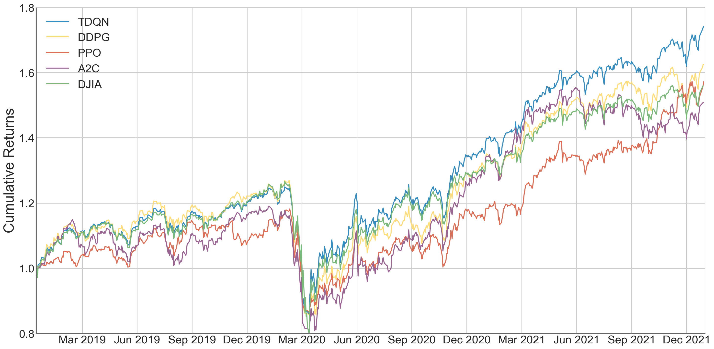

# Trading Deep-Q Network (TDQN)

The project is part of my Master’s Degree Thesis _**Exploration Techniques for a Deep Reinforcement Learning Trading Agent**_.
The goal for this project is to develop a deep reinforcement learning agent to trade financial securities in any market.
The proposed algorithm must reliably outperform traditional financial indexes and other deep reinforcement learning algorithms while exposing itself to minimal risk.

Our approach is to enhance a single DQN agent to deal with financial markets in their entirety, to solve this task we progressively enhance its ability to deal with
a complex multi-asset trading environment. The steps to build-up the algorithm are:
1) [Action branching architectures](https://arxiv.org/abs/1711.08946), 
this architecture achieves a linear increase in network outputs and allows off-policy algorithms such as DQN to operate effectively in domains with high-dimensional (and also continuous) action spaces.
2) [Distributional reinforcement learning](https://arxiv.org/abs/1707.06887) with [Quantile Regression](https://arxiv.org/pdf/1710.10044.pdf),
approximating the full distribution preserves multimodality and makes the agent more risk-aware. This also increases the agent’s robustness by improving its ability to propagate rarely occurring events.
3) [Noisy Networks for Exploration](https://arxiv.org/abs/1706.10295),
having weights with greater uncertainty introduces more variability into the decisions made by the agent which is what makes for effective exploration in a complex financial environment.

The name Trading Deep-Q Network (TDQN) is only introduced for the sake of clarity and convenience.
The algorithm ultimately is a Quantile Regression Branching Deep Q-Network agent with noisy linear layers.
For a more detailed explanation read the full project [report](report.pdf).

### Experimental results
| | TDQN | DDPG | PPO | A2C | DJIA |
| --: | --- | --- | --- | --- | --- |
| Cumulative Returns | 74.1% | 62.5% | 57.2% | 50.8% | 55.9% |
| Annual Return | 20.3% | 17.6% | 16.3% | 14.7% | 16.0% |
| Annual Volatility | 20.4% | 21.0% | 19.5% | 22.3% | 23.6% |
| Sharpe Ratio | 1.01 | 0.88 | 0.87 | 0.73 | 0.75 |
| Calmar Ratio | 0.65 | 0.54 | 0.61 | 0.48 | 0.43 |
| Stability | 74.5% | 59.0% | 60.0% | 54.8% | 67.8% | 
| Max drawdown | -31.2% | -32.5% | -26.7% | -32.0% | -37.1% |

TDQN strategy manages 30% improvement over DJIA and 14% improvement over DDPG in risk-adjusted returns.



### What is this repository

This repository is a fork of [SB3-Contrib](https://github.com/Stable-Baselines-Team/stable-baselines3-contrib), which is an extra package for [Stable-Baselines3](https://github.com/DLR-RM/stable-baselines3).
The algorithms are meant to be used in conjunction with [FinRL](https://github.com/AI4Finance-Foundation/FinRL), the deep reinforcement learning framework for quantitative finance.

### Future works
We are confident that the methods and exploration techniques behind TDQN are great tools for automated trading with reinforcement learning.
As such, we plan to integrate these solutions with more advanced models like [IQN](https://arxiv.org/abs/1806.06923) and [FQF](https://arxiv.org/pdf/1911.02140.pdf).

## Fork Additions

**RL Algorithms**:
- Branching DQN (BDQN)
- Quantile Regression Branching DQN (QR-BDQN)
- Trading DQN (TDQN)

**Features**:
- NoisyNet Layer
- NoisyNet MLP

## Installation

To install this repository:
```
pip install git+https://github.com/zappavignandrea/tdqn
```
A Conda environment file is also available for manual installation [here](environment.yml).

## Citing
Feel free to use this code for your own projects or research. Please cite this repository:
```
@misc{tdqn2022,
  author = {Zappavigna, Andrea},
  title = {Trading Deep-Q Network},
  year = {2022},
  publisher = {GitHub},
  journal = {GitHub repository},
  howpublished = {\url{https://github.com/zappavignandrea/tdqn}},
}
```

## Acknowledgements
Special thank you to my supervisors Prof. Luca Cagliero and Dr. Jacopo Fior of DBDMG (Politecnico di Torino) for their guidance in this project.

